Sleeping and fishing mechanics have arrived in Automatia!

<!-- truncate -->

## New blocks

I updated the chest model and added a bench.

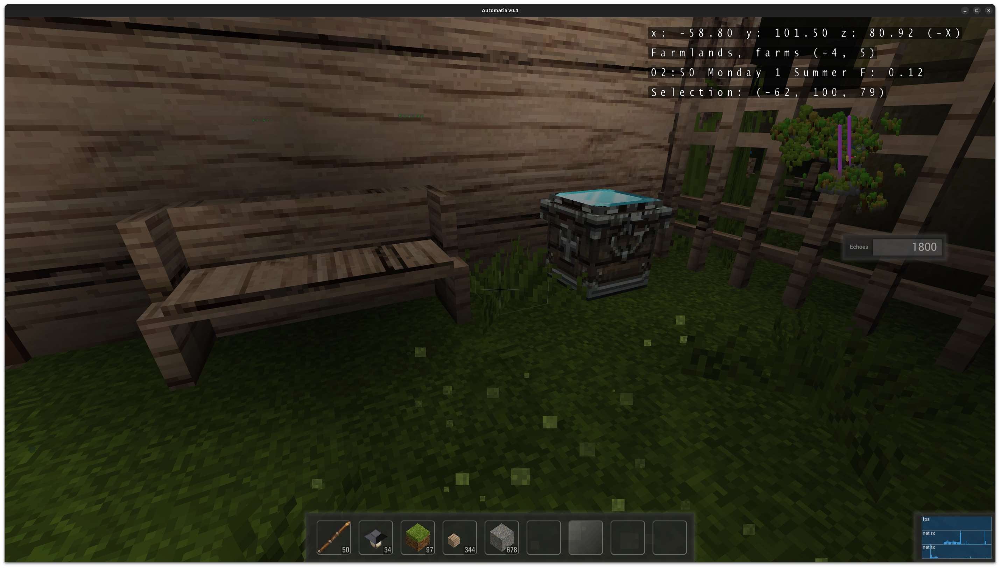

You can sit on benches:

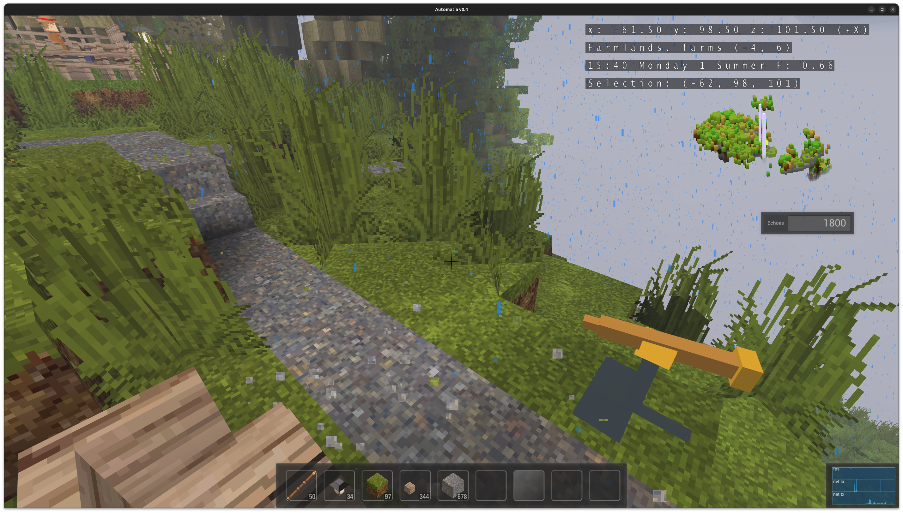

The new fence gate works like one of those that I see a lot here in Norway. It turns 90 degrees and stays open:

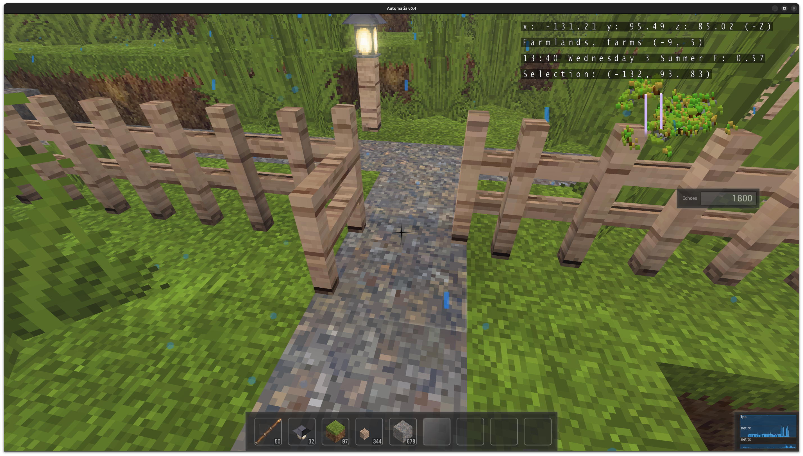

The new shelf is intended to make shops more varied:

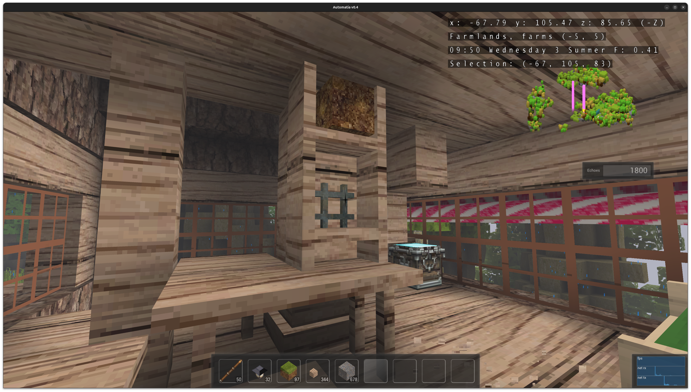

I made awnings for the store. I've thought about making them bumpy:

Table blocks can now be stacked to make scaffold-looking towers that you can walk under:

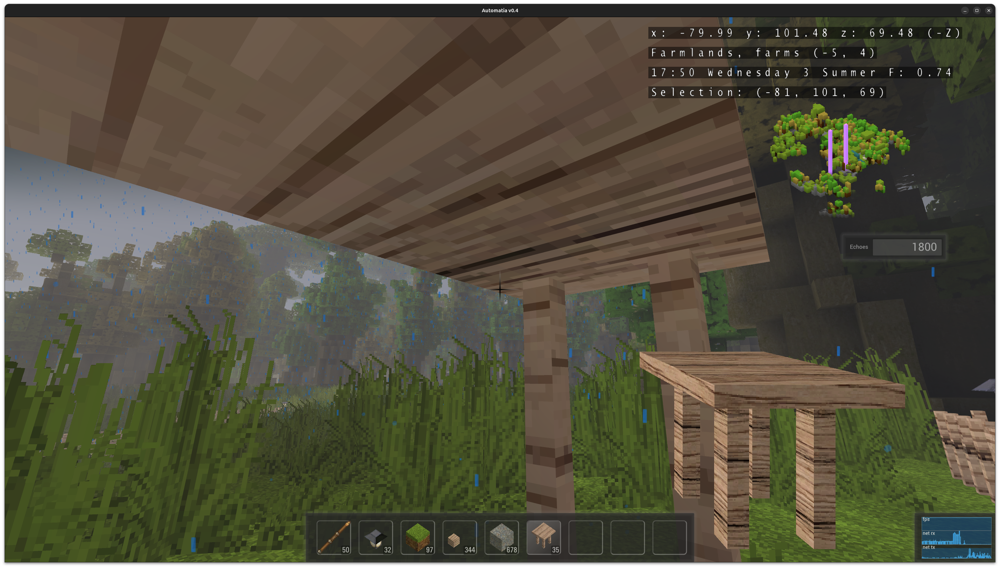

Fences can now have proper corners (and they are automatic):

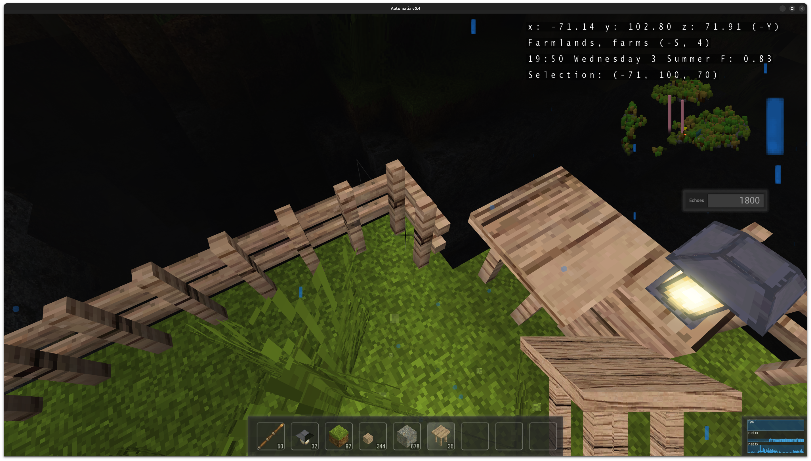

I made water create natural waterfalls that self-remove when the source runs out:

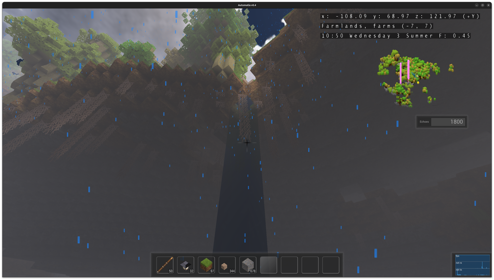

These have special interaction with the "void":

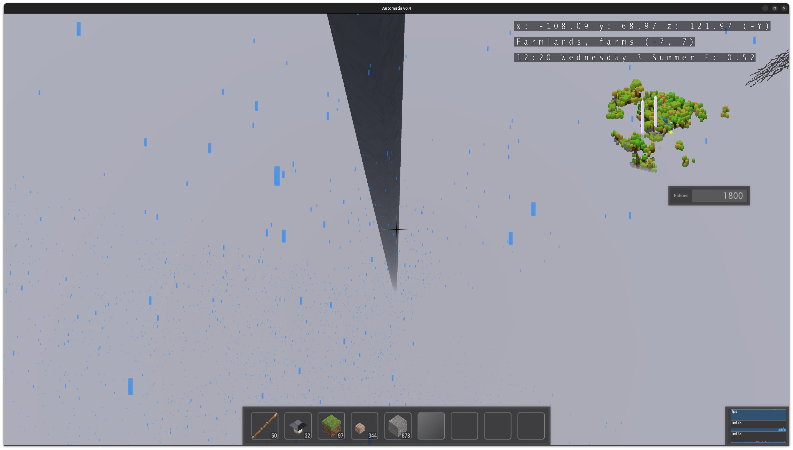

The waterfall looks endless when it hits the bottom of the world!

... and many more things.

## Telescope

The telescope can let you view distant things:

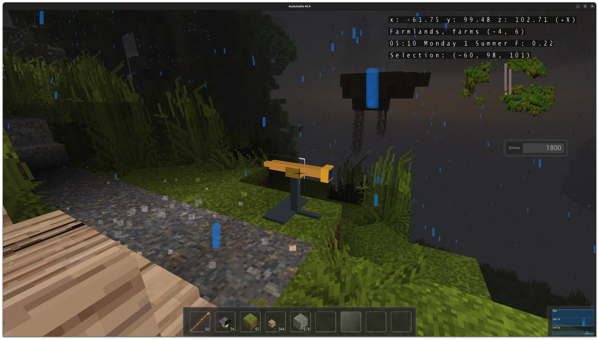

You can interactively orbit distant objects:

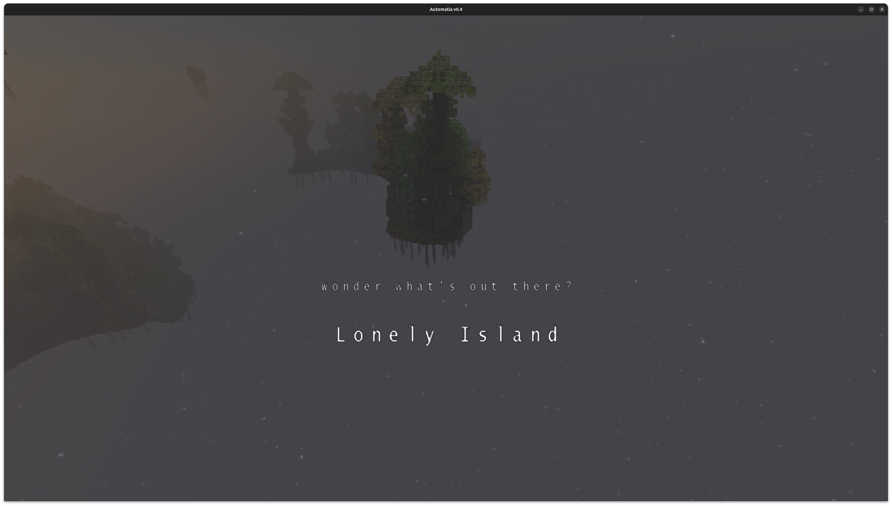

## Sleeping

Beds can be slept in and progresses to the next day:

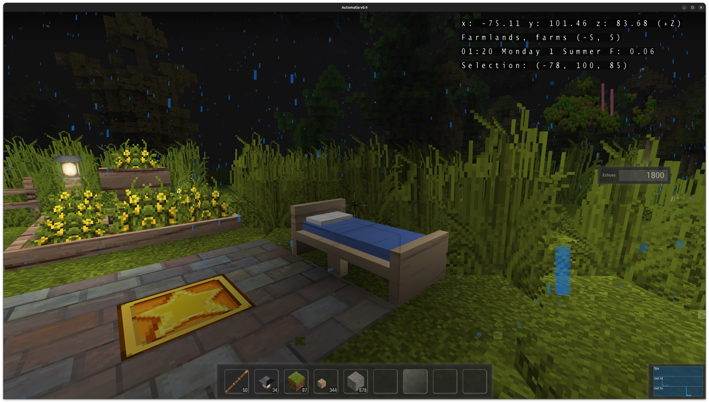

I still haven't decided on exact mechanisms around day changes, but.. all the sub-systems do the correct things. Stores close, NPCs go where they are supposed to be. It all works and I'm quite happy to be at a point where I can say that. But, I don't know if I want to make a bigger deal out of day changes. Right now it's just a way for players to change the day, and perhaps that's enough.

One nice thing about forced sleep is that it changes your focus and lets you take a break from whatever you were rushing to do the day before. If there is no limit to the amount of fishing you can do, some people will fish for hours just to get a nice thing from the store. A day change lets you take a break and look at other priorities, or experience new things. Ideally, there is something new every day, for example.

## Fishing

I've implemented basic fishing now:

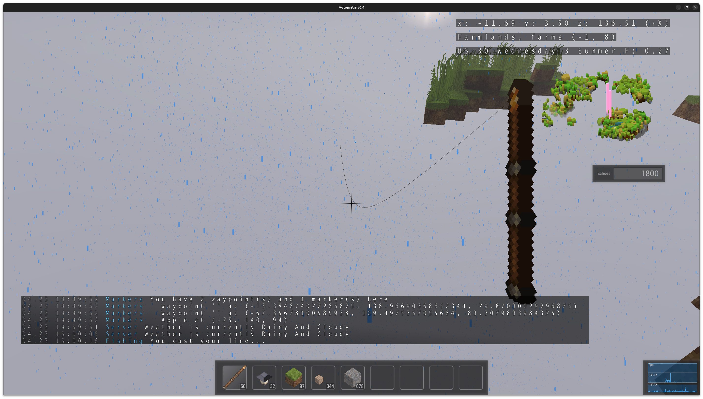

Visually it's missing a hook and a bobber, but the line is there. It snaps if you reel too soon or the fish gets away. You can get legendary sticks from fishing:

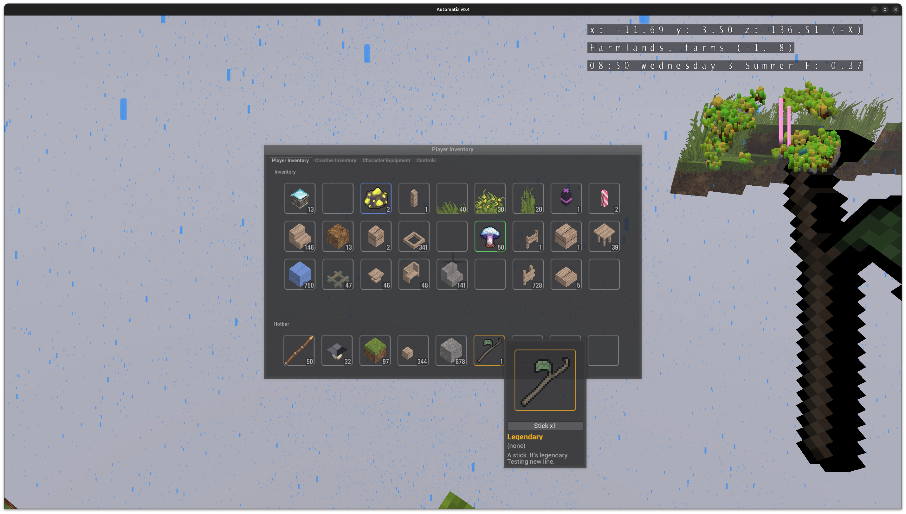

I have made loot tables for fishing and ways to make places, ponds, sky fishing etc. give you different loot. What's missing now is a proper minigame for fishing, as right now you wait for the fish to bite, wait for the line to straighten and then pull up the catch.

My thinking is that some things, like sticks, should not require you to do anything more than just reel it up. However, previous loot will need some effort. We'll see how it goes.

## Next steps

I'm going to flesh out fishing more, think a bit about day cycles, and I'm going to renovate the shop and introduce the new shelves there. Right now shops auto-detect display boxes, but not shelf blocks. It's a small change, but I think it will make the shops even better!

-gonzo
