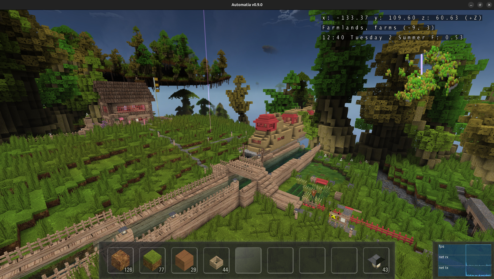

Trains have arrived in Automatia! Full train lines with schedules, carriages, crew and cross-world travel.

<!-- truncate -->

## Train lines

I've built a train system where trains follow a 24-hour schedule. Each train is made up of a lead train and carriages, and they are all block entities backed by the NPC system. This means that every part of the train can follow a routine, and carriages can be attached to each other. The higher-level train line knows where everything is in relation to the schedule, and the trains move accordingly.

The trains jump between worlds. The 24-hour schedule is designed so that a train only exists in one world at a time, but still accounts for the full day. When a train reaches the end of the tracks in one world, it despawns and appears in the next.

The trains fly in the air, and I made both hidden and visible tracks for them. Hidden tracks let the trains appear to fly freely, while visible tracks give a more traditional railway look. So, it's possible to make more traditional rail lines, and yes it would actually be possible to have players make train lines in the game without needing to script anything. Future work, of course.

Players can sit on the train and ride it to the end of the tracks. Ideally, the player would be teleported to the new train on the other world seamlessly, but that hasn't been solved yet. For now, the player is teleported to the station in the next world instead. One step at a time.

## Train crew

NPCs on the train can have their own routines relative to the carriage they're on. So, a conductor NPC can walk around inside the train, interact with passengers, and do their own thing, all while the train is moving between stations.

Players and NPCs can sit on benches in the train.

## The /railscan command

To make building train lines easier, I made a `/railscan` command on the server. It scans the track in both directions from the player and uses the player's look direction as the direction of the track. The server outputs all the waypoints of the track (without time) on the console.

Then, in the train line definition, you add all those points and specify when (in 24-hour time) the train enters the world, when it reaches the station, how long it waits there, and when it reaches the end of the track. The track builder API makes the train's speed match these constraints, so the train always appears at the right time everywhere.

This makes it much easier to create and update properly scheduled train lines. It really is a non-issue now.

## Block entities

Block entities are getting more and more advanced. You can now open/close doors, hatches, windows etc. Sit on benches, sleep on beds. It is, however, currently not possible to interact with block inventories, which should be simple enough to add. It's just that for eg. trains they are ephemeral. So if you put something in a chest it won't be there next time. If you take a flower from a pot, it will be back again. The simple solution is to not allow this on trains.

Block entities don't have to be trains. They can be anything from player-made ships, to flying floating island platforms.

## New features

New real-time shadow mapping and SSAO adds to the overall lighting. There are many corners in voxel worlds, so even simple SSAO makes a lot of sense.

New chatbox with auto-complete for commands.

New flower pots. I'm not sure if they will stay as-is, but they were needed in many places as I was using the plantbox (which is more like a flower bed).

Added slow-blinking lights, which I'm currently only using for train stations.

Added a two-legged signpost which you can attach things on.

In the center of the pond is a new pond-block which can be used to maintain a pond at a certain level. Maybe you can see it, but the pond is not a full-height. I also made lilypads match the height.

Stores now have support for shelves, and can have their own special sections. There is a small magic section in the store (the brown shelf).

I added some wide doors, but I think they need a proper handle.

I improved the worktable model as well to match the chest, I guess. As always, the graphics is temporary and needs to be replaced with something that matches the style of the rest of the game.

## Next steps

The big remaining piece for train lines now is seamless cross-world travel for players sitting on the train. I've also had some thoughts about ships on water. We'll see.

Anyway, the immediate next steps has to do with gameplay. Right now it's finally possible to cross worlds. What's needed now is for a player to be able to enter a randomly generated world where he can do whatever he wants, including gathering resources. That will be the beginning of some kind of gameplay loop.

-gonzo
