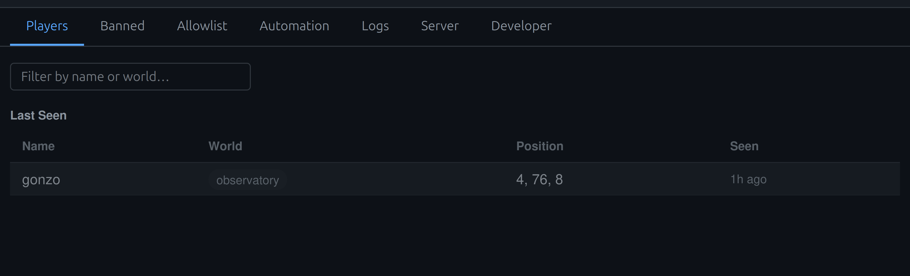
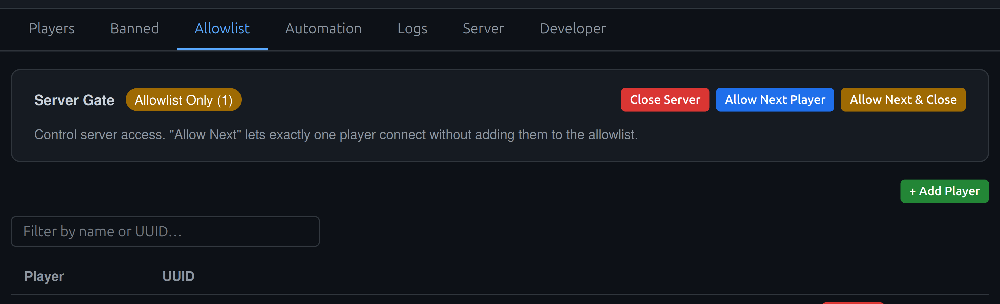
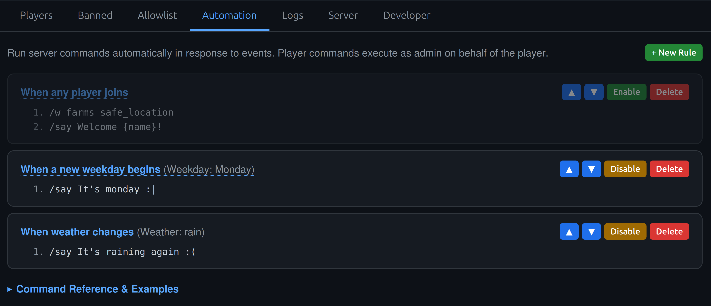
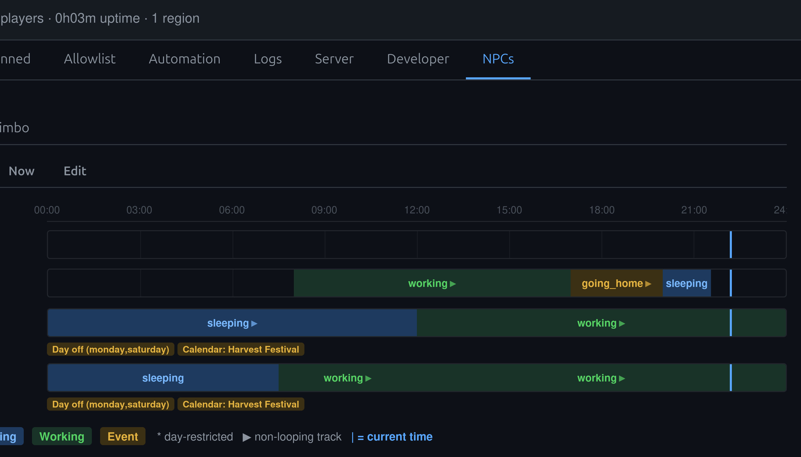
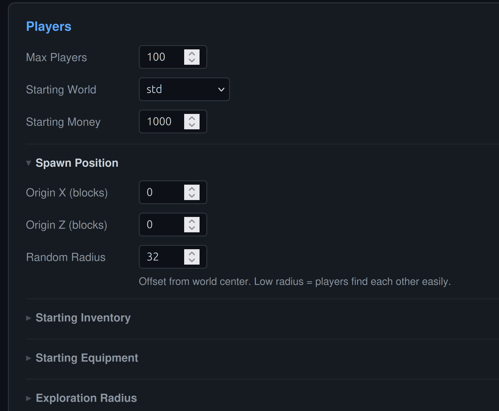
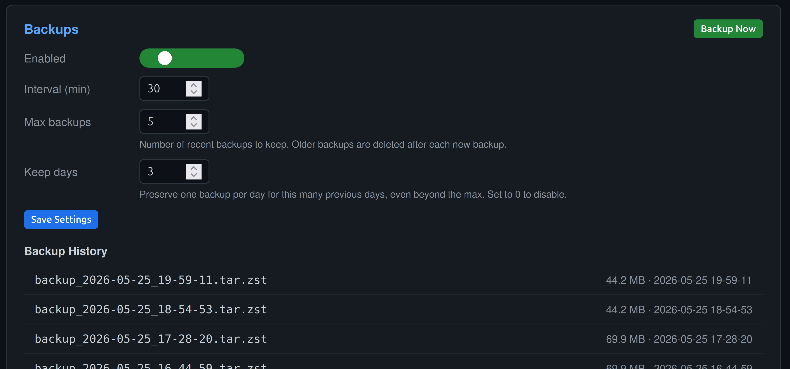
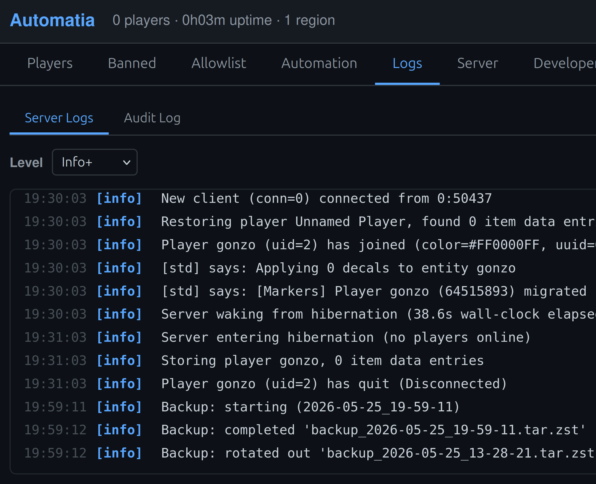

Automatia now has Web UI for server administration built with Deno. I added everything I could think of. Relevant to server admins and my own development, of course.

<!-- truncate -->

## The Dashboard

The C++ game server exposes an HTTP API on localhost, and the Deno dashboard proxies requests to it from the browser. The dashboard handles authentication, TLS, and all the UI on top.



It's a single-page app with no framework, no build step, and no external dependencies. Everything is bundled into one HTML response at startup. I wanted something that just works and Deno made this surprisingly painless. (Note that I have no experience with any other webshit.)

It has the usual features: Managing players, allow lists, ban lists, etc.



Some noteworthy things are:

- The allowlist system has a buzzer-like feature. There's an "Allow Next Player" mode that lets exactly one connection through without adding them to the permanent allowlist. Useful for when you just want to let one guy in and you don't want to look up their UUID.
- Name reservations that tie a player name to a specific UUID, preventing impersonation.
- Last seen players, so you know who was on, when and where.

## Automation

I don't know why I did this. You can create event-driven rules that run server commands automatically. There are 12 trigger types: player join, player leave, chat messages, world changes, server start, weather changes, time of day, new weekday, new season, player count thresholds, and more.



Each trigger can have conditions. For example, you can make a rule that only fires when the weather changes to rain, or only on Mondays. Commands support string interpolation, so you can do things like:

```
/say {name} Welcome to {server_name}! You have {attr:money} McCoins.
```

Somehow I actually ended up using. It's kinda cool actually.

## NPC Editor

Hidden behind a developer toggle (due to the massive-in-the-extreme spoilers), there's a full NPC management system with three views per world. It's for me, obviously, and I really really needed a way to visualize where my people are at times, and to be able to edit them in a sane way. I used to instantiate routines and everything in C++. Then I migrated to JSON and I hated it. The dashboard really made the difference because it acts like an always-up-to-date whiteboard for me.



I've cut off the names. Hopefully this won't spoil anything.


It's made it easier for me to design their days, which are very relaxing compared to mine. I'm envious.

## Server settings and backups

The server tab made me really think about how the new-player experience could be managed by a private server. I wanted the server admin to be able to choose between various modes of spreading people out, limited them into individual bubbles, shared bubble etc. In the end, it's not perfect, but it will allow you to mostly handle spawn in a somewhat customized way. In the future I will make it more clear what will happen and add more features.



After a good nights sleep (one of them), I woke up to find that the server had created 3000 (not really, but yeah) backups while I slept, so I had to limit it to 1 backup after server enters hibernation (nobody is online). I also realized that if you create a backup every 30 minutes (fine) and someone griefs (bad!), then if the griefing happens at night, the backups you keep will be a limiting factor. The default is 5 backups kept. Essentially, the griefer could stay on long enough to make sure every backup is unusable. So, I had to make an extra default, which is to keep up to 3 daily backups in addition. Meaning, keep backups from the last 3 days, and the last 30 x 5 minutes. Hopefully that solves that.



There's also a real-time log viewer with level filtering, and a separate audit log that tracks every admin action regardless of whether it came from the console, the web dashboard, or in-game commands.



All of these things are mostly about creating API endpoints with cpp-httplib, and then wiring it up in Deno.

## Multiblock machines

I've been working on multiblocks for a long time, and I finally did the thing I've been wanting to for a while: Use room files to describe machines, with support for rotations. So, with that I made an ore crushing machine, a wood cutting machine, a painting machine. An algae bath (I was inspired by a machine I remembered from Gregtech), that has a custom fluid that grows things and changes color.


My sister explained to me that this would not do without a magic fuel, a tank for the fuel and pipes. So I made that too.


They work, no infinite looping since it only cares about end-points, and it's a simple system. The tanks stack and self-settle. I'm happy with the complexity level, and I might reuse it for other types of things too. We'll see how it ends up.

## Magic and wands

I've added a bunch of wands: flower wand, blasting wands, paint wand, ore finder wand, growth wand, and a floating platform wand. Each has its own cast times, glow effects, and sounds.


I also experimented with a hookshot, and with physics-based springs, and magic doors that can be dispelled.


And I added some kind of hover rings to the trains. Not sure if good.

## Gamepad support

Full gamepad support is in. You can navigate inventories, browse recipes, switch tabs, and play through cutscenes with a controller. I also added a toddler mode for the youngest testers.

I have some kind of PS2 or PS3 controller that I've mapped to the game. No way to change the mappings yet, but it should be easy to add.

## Next steps

Making content is easier now because so many precedents have been set. One wand leads to more wands, one machine leads to more machines. The NPC editor leads to more NPCs, and with one of the latest features being real-time pathfinding, I'm now just setting locations where they're at.

The absolute latest work has been on portals. Not going to elaborate more, other than that I'm working on the initial/starting story.

Thanks for: reading.

-gonzo
