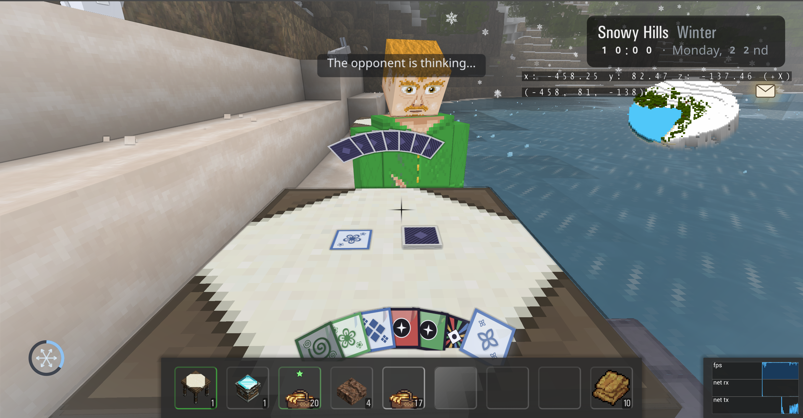
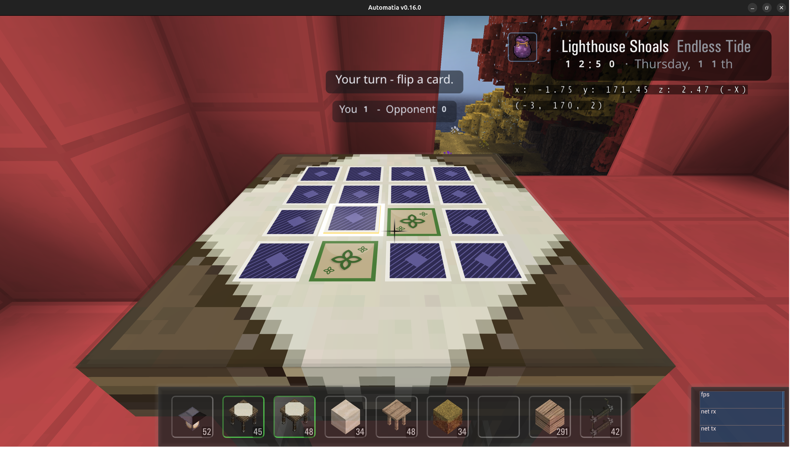
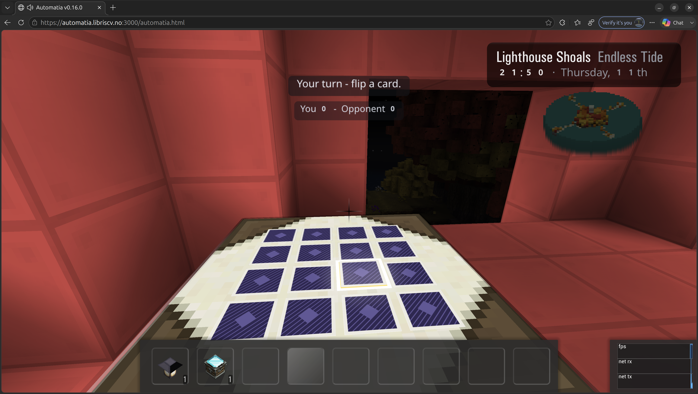

This week I added mini board games, a Web build and the shape of a new story world.

<!-- truncate -->

## The card game

The deck is built around 4 colors: red, green, blue, and a golden yellow. There are 6 glyphs per color, with two copies of each, so 12 cards a color. The glyphs are just something I liked the look of and though would stand out, I guess. On top of the regular cards there are:

- 4 color-changer cards, one tied to each color, that set the active color to their own when played.
- 1 joker, which is where things get interesting (see below)

Strictly speaking, I don't think the color-changers are necessary, but my simulations show that the win chance of either side is fairly equal. The player who goes first holds a slight edge of about 54%. I believe the starting side has a small edge in pretty much all games, so maybe nothing to worry about?

Play is a color-matching loop: there's an active color on the table, and on your turn you play a card that matches it. First player to empty their hand wins.

Every game needs a twist though: Instead of openly playing a matching card, you can place *any* card **face-down** and *claim* it matches the current color. Nobody else can see what it actually is.

Now the opponent has a decision to make. They can **call** the bluff, or let it stand. Both of those can go wrong:

- **Let it stand**
	- The card is quietly removed face-down. It is never revealed, and it is gone from your hand. The active color doesn't change and nobody draws. You dumped a card, legal or not, and nobody will ever know which.
- **Call it, and you were wrong**
	- If the card really did match, it flips face-up and becomes the new top card after all. And *you*, the accuser, **draw a penalty card** for the false alarm. Calling is not free.
- **Call it, and you were right**
	- The card didn't match. The bluffer is caught and has to take the card back **and** draw an extra one, ending the turn with *more* cards than they started.

So bluffing lets you shed cards you couldn't legally play, at the risk of getting caught and going backwards. One catch: a face-down bluff never sets the active color, so an open play stays the only way to actually steer the game. The tension is entirely in reading whether the other person is lying, on both sides of the table. Which doesn't work too well on voice chat. Ah well.

## The joker is a hot potato

The joker bends all of that. It can *only* ever be played face-down, as a bluff. If the opponent challenges it **he has to take the joker into his hand**, plus draw a card.

The simulator shows holding the joker is a slight edge. The take-it-on-call rule exists mostly so that edge doesn't permanently stick to whoever happened to be dealt it.

Me playing with iFire in a random/private nook of the winter world. You can see I had the Joker from the start. The cards are generated in a python script, so they don't have any fancy graphics.

### Tuning the joker with a simulator

I don't know anything about card balance, so I wrote a little simulator (`tools/cardgame/balance_sim.py`) that plays the AI against itself tens of thousands of times and reports who wins. The most important number it spits out is the **joker edge**: the win rate of whoever was dealt the joker, where 50% means the card confers no advantage at all.

My first instinct for punishing a wrong call on the joker was: remove the joker and make the accuser draw three. It turned out to be terrible. The joker became a free, no-risk card *and* it scares the opponent into never calling anything, I guess.

| Joker rule                          | Dealt the joker | Held it longer |
|-------------------------------------|:---------------:|:--------------:|
| Muck it, accuser draws 3 (first try)|      55.7%      |     55.4%      |
| **Take it, draw 1 (shipped)**       |    **53.0%**    |   **49.7%**    |
| Take it, no extra draw              |      50.8%      |     49.5%      |
| Take it, and you can't win on it    |      49.8%      |     45.8%      |

I went with **take it and draw one**. It keeps a tiny bit of "ooh, I drew the joker" luck in the game without it being a dominant free win, and it sometimes keeps the card in circulation instead of always quietly vanishing.

Games run around 17 turns on average, which I thought was OK.

### A simple memory game

I also made a simple Memory game to exercise the new board game sub-systems:

It's also multiplayer. My (really) bad memory is making it impossible for me to win these. I added this purely to convince myself the sub-systems allow for more than one game, and this was the easiest to add. I reused the card deck and most visuals. But the logic is of course unique.

Now, thinking about it, this game is perfect for my 3-year old. My attempt at making this game toddler-safe so far has not worked though. They are just too wild with the controls.

## The lighthouse world

There's a new **lighthouse world**: a lone lighthouse surrounded by a big open ocean. It's meant to be a calm, quiet place. Listen to the sea and the occasional birds, and just relax. Maybe fish a little?

The world only has seagulls for now. I'm going to add a lone NPC there with a surprising story.

## Browser builds

There are now regular **browser builds** of the game. They're known to work well on both **Firefox** and **Chrome**, so you can jump straight in.

The screenshot is from Microsoft Edge, in the new lighthouse world, which still has some rendering issues, but they will be ironed out.

You can try it here: https://automatia.libriscv.no:3000/

Fair warning: It's the development server, and it goes up and down a lot. And it will reset frequently.

## Next steps

As always, I know a little bit more about what I want to do, which feels nice. I always had this idea that I would hide the story worlds, and now I have an idea how it's going to happen, for the most part. So yeah, if you're joining the game and wondering where everything is: Who knows, man. Who knows.

I want to integrate the card game into the story, and there are many possible roads. I won't spoil too much, but the NPCs aren't going to play fair.

Bye.

-gonzo
