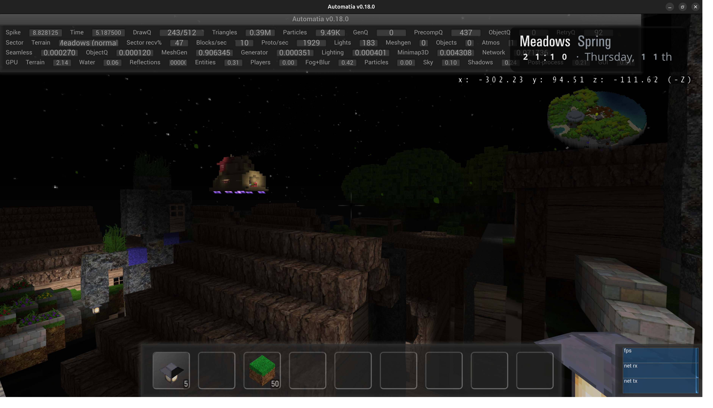

This week the lighthouse world got tide water, a proper login screen landed on both desktop and Web, gamepad support finally reached the browser, and block entities can at last rotate. Oh, and there's a travelling boat salesman now.

<!-- truncate -->

## The rising tide

The lighthouse world now has a real **tide** that goes up and down. Most of the time it stays well below the rocks, but every so often it climbs, and on rare occasions it rises all the way up to the base of the lighthouse.

The tide serves a double purpose, enabling water worlds. Normally, water worlds could be made with just fluid blocks, however this creates a lot of churn and it turns the world design itself into a fight against constant churn. The constant water removes this problem, and as a drawback complicates air pockets.

On top of that, the whole world is now ringed by a **living fog** that swallows travellers who try to escape. And it doesn't sit still: every now and then the living fog grows into a storm, creeping a little further in. What's causing the tide and the storm? Who can say.

<video controls src="/Video_2026-06-25_19-45-21.mp4" title="Title"></video>

## A proper login screen

A lot of jank got dealt with this week, and the most visible result is that the client now has a proper **login screen** on both desktop and Web builds.

## The voxel frame becomes a drawing canvas

The voxel frame now has a dedicated **drawing widget**, which finally makes it usable. Previously you had to press a button for *each individual pixel* to set it. Horrible, I know.

Now it's a simple drawing canvas: **right-click to lift a color**, and **hold left and drag to draw**.

## Rendering scale

There's now a **rendering scale** option in settings (F1), which should make it easier for lower-end machines to handle the screenspace passes. You trade a bit of sharpness for stable FPS. Also useful if your monitor has a very high resolution.

The GUI is now updated only when needed in Web builds, which already was the case on desktop clients. Since it's no longer updating every frame this reduces the frame time meaningfully in the browser.

## Polishing Web builds

I've worked a bit on Gamepad support for browser builds and now I can finally say _it works on my machine :tm:_, which is the highest form of QA I am willing to commit to in writing. I also fixed a bunch of other gamepad jank too, like chest hotbar access was apparently broken.

We also fixed other key binding issues and even got the game to work on the LibreWolf browser, although you [will have to disable `resistFingerprinting`](https://codeberg.org/librewolf/issues/issues/1883) to be able to use the ctrl/shift keys alone.

And finally, we now also have full FMOD support on Web builds, which means Reverb and positional sounds. If it stutters it can be disabled again in settings, which then uses the WebAudio backend.

## Block entities can rotate

Perhaps the biggest change this week: block entities (trains, boats, and friends) can now finally **rotate properly**. This has been a long process, and it's probably going to enable some cool things down the line.

<video controls src="/Video_2026-06-22_19-21-19.mp4" title="Title"></video>

## A dungeon door that actually opens

There's a new work-in-progress **large dungeon door** block that opens smoothly in real-time.

<video controls src="/Video_2026-06-24_21-57-45.mp4" title="Title"></video>

## Next steps

Continue work on the early-game economy.

Bye.

-gonzo
