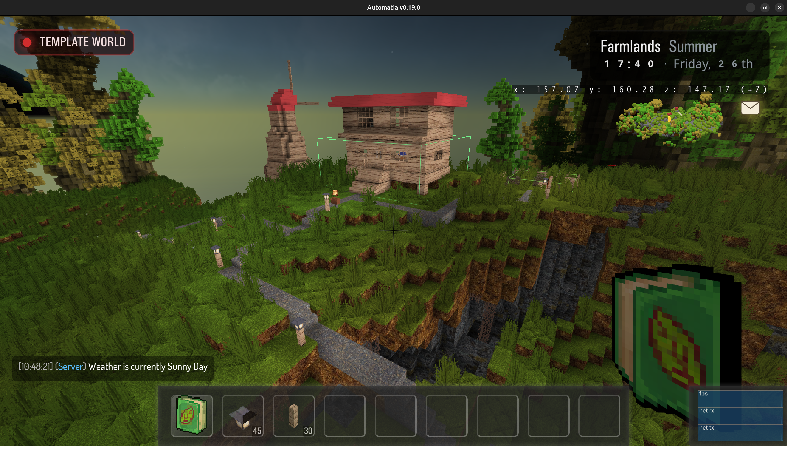
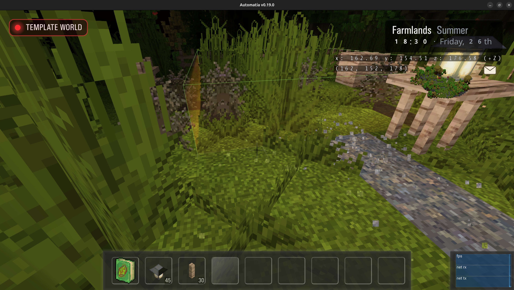
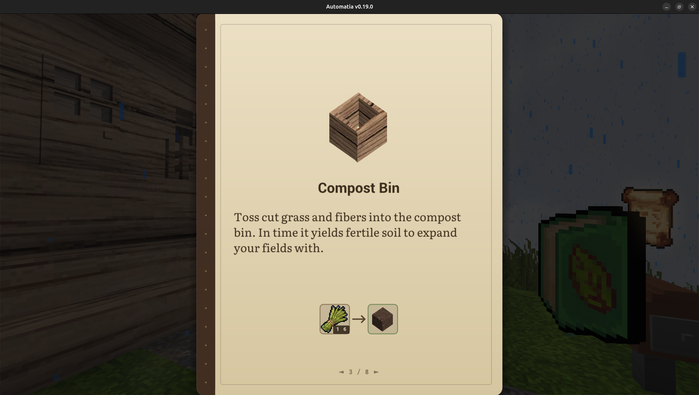
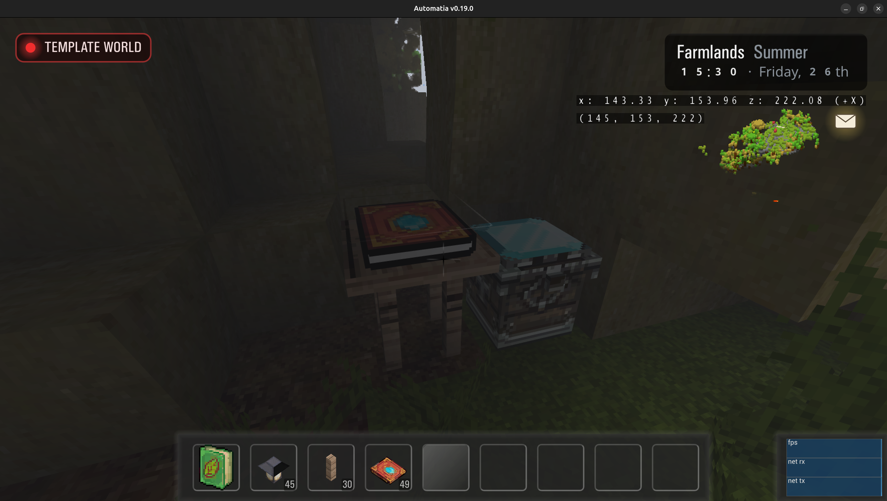

The game no longer starts you in a procedurally generated open world. Instead, you begin in a hand-made story world: the place where the story NPCs live, where the shops are, where the trains run. It's a real, curated starting point rather than a random one.

<!-- truncate -->

## Greenfield Farms

Since the beginning, this game has dropped players into a shared procedural open world. It is now creating a per-player world instance, putting each player into their own story. It will eventually be possible to invite friends and play in groups, however the GUI is not made yet. For now, it is possible to get a server admin to teleport players into other instances for cooperative play.

The story now starts in Greenfield Farms, where most of the story NPCs live, where the shops and services are, and with a train station.

### No more digging

As a consequence of moving to a curated starting world: players can no longer arbitrarily modify the world, and things like throwing dynamite around is off the table. The story world is meant to stay intact, for story, events and NPCs.

Players can instead buy plots and fields, and restore things through materials and hard cash. Each with upgrade tiers. So, each player does get a modifiable stake in the world, which expands over time. When trying to modify the world outside of those bboxes, they will flash briefly:

The procedural worlds are still there. They'll return as places you travel to in order to spelunk for ores and discover things. It's also intended that players could decide to not return to the story world and just stay out in the wilds, because why not. Not sure about the return path though, but there is currently a Home button in the main menu.

So, the split is now made final: Story worlds will have all the things this game uniquely brings to the table, while the procedural worlds will be mad max arenas with dynamite and meteor showers.

### Template worlds

The system I just described is achieved through template worlds. Worlds that I as a gamedev hand-craft, and then when a new player creates starts a new character, that template world is copied into the players instance, and turns into the players own world. If I make a change to the master template later, that player is unaffected. He is still playing his version.

Funnily, this also means if I forget to remove something I'm testing, players could end up with it in their worlds.

As for the scripting, it is not persisted with the instances, so if I make changes they will follow. That can be good and bad, as fixes will apply to older instances, but any gameplay additions will also follow, which can be relying on terrain modifications that aren't there in those older instances. In any case, this is not an issue during development.

### Why

Good question. I don't think most players have the patience to discover from nothing, with no hints or help. Players with a lot of patience are going to speedrun to the procedural portions anyway, and perhaps just stay there forever. Meanwhile, there is now the beginnings of a curated story which was the plan all along. The procedural portions was for testing: The story worlds were unplayable, since I didn't have instancing support. So, it came as a consequence of having people try the game and explain to me that it can't just be a sandbox, even if there is something meaningful that comes later. That's fair.

This was going to be a cozy RPG anyway, a neighborvania if you will. I have enough gameplay content to start making the actual game. The instancing parts took a week or so to land, and since it deals with persistence and to an extent the health of the server and my system, it had to be done properly. This is why this blog post is light on content.

## Story world design

The hardest parts right now is polishing the early game and making sure that things are interactable in a way that isn't incompatible with the wider story world. Story worlds are not just terrain with NPCs on it. They are supposed to have a lot of interactable content, secrets, platforming and be gateways to other story worlds. But, everything takes time and some planning. There are actually 400 unique blocks and 800 unique items already, which is strange to think about. Every single block is unique in interaction and purpose. Items less so, but that is because many of them are intermediate crafting items. And all of this has to be balanced into progression-based gameplay.

As an example, I am currently thinking about introducing flowers to the area around the player, however it would be strange if they had no mechanism outside of looking pretty. But, I also need a plan for what they will be used for, which determines how many flowers there should be, how visible they should be, and how close they should be to the starter area. If the flowers are supposed to be rare, they should be placed in nooks and crannies, so that the player has to explore. And so on.

Another issue is the importance of having something to look forward to. There needs to be interesting sites around the player that they cannot reach early-game, but they have some idea it will be accessible if they just do this or that. Right now, the content is sparse and there isn't much to look forward to. But, it will grow over time. Especially since there are many functional skills in the game, of which only two are accessible at the start, which is crafting and farming.

Platforming and multiple worlds adds new dimensions all by themselves. Players likely don't expect that they will need climbing gear to reach a certain place, or winter clothes for a certain world. Or dungeons.

## World travel

It's been the case before now that everything is just available, however no more. From now on players have to unlock access to new worlds by finding rare collectibles. These collectibles are hidden around the world and will need exploration and platforming to find and collect.

Once a player has enough, he can attempt to unlock a train line which starts taking passengers to other worlds the next day.

## Books

There are now books in the game. Books act as manuals for the game, and can grant certain things like discovering a recipe or learning a skill. The player starts with the beginners manual, which explains farming and composting:

Later on, the player might discover new books, which who knows what they contains:

## Final thoughts

I'm overall quite happy with the architecture now, and I think it can host a game that is unique, combining many genres and expectations into something new and interesting. The fact that it's multiplayer and players can join from a browser tab now is quite nice. I can have someone join to test something in ~15 seconds.

On top of that, the systems in the server and client have a lot of precedents now, and I'm fixing less and less bugs that deal with broken features. As a result, it's easier to add new things. The attribute system especially has simplified many new problems and features, because they are persisted everywhere, and can be broadcast over network and via RPC.

Thanks for reading. Bye.

-gonzo
