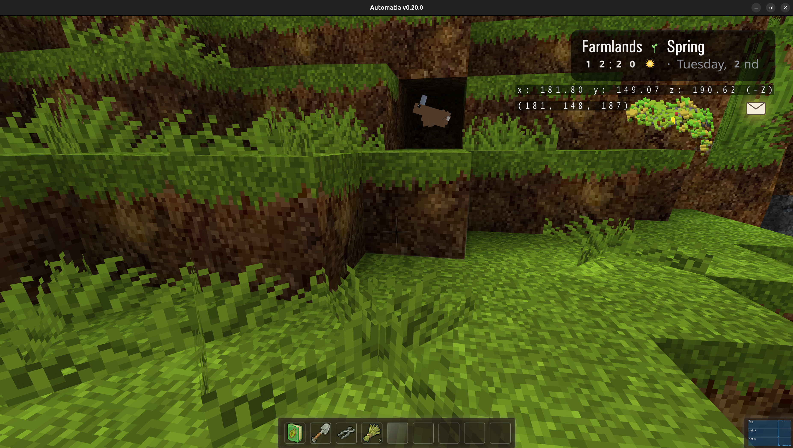
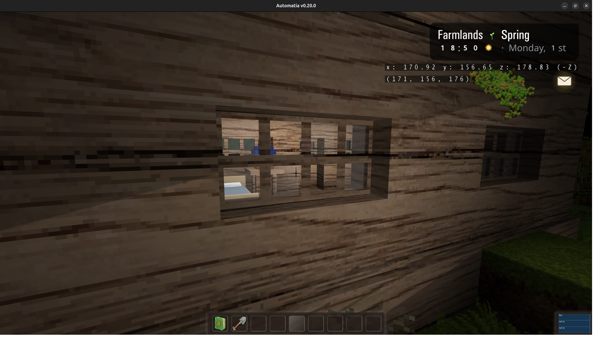

An early-game game loop prototype is now working fairly well. This week was mostly polish and reliability. You can now join a friend with a simple code at login, co-op finally shares money and progress, and the skill system got a full revamp. Meanwhile winter turned cold and harsh, mud-water will ruin your day, and there's a new hare companion to keep you company.

<!-- truncate -->

## Early-game polish

The first hour(s) of play now hangs together as an actual experience, instead of a pile of systems here and there. On top of that is a lot of invisible work: hundreds of important bugfixes to make the game more reliable and frictionless. Things that used to break or simply feel bad now mostly feel alright, I guess.

## Co-op play

### Friend codes

There is a friend code in your Home tab in the main inventory, which you can give to a friend. They can then paste it at login, and they end up in your world (and get a free bed in the mail).

This is the most important piece that co-op players have been waiting on. The instancing work from earlier updates made it possible, and this weeks work has finally made it somewhat reliable. You may now try the game with your friend(s)!

### Progress sharing

Co-op play now has shared money and other progress with friends. When you're playing together, you're actually playing together. The wallet is shared, and progress carries across everyone in the instance rather than each player quietly tracking their own thing.

There's also proper bed-sleeping synchronization now. Sleeping through the night is a shared act, so everyone needs to be in bed to skip to morning.

## New tools

Three new tools this week: shears, shovel and axe. Each one does the obvious thing, and a few non-obvious things. The shears is for cutting and trimming grass. The shovel is for soil and for transplanting flowers (a must for apiaries). The axe is for wooden things and log harvesting. No big surprises yet!

Use the right tool for the right block, and there will be more skill tie-ins in the future.

## Skill system revamp

The skill system has been revamped to 0-20 levels, with an unlock required at 10 to progress further. The unlock requires exploration and visiting other worlds.

The 0-20 range is separated into 5 levels which each give a permanent benefit.

## The hare companion

There's a new hare companion NPC living in a nest nearby. It joins the growing cast of animal companions and adds a bit of life to the early game.

If you befriend it, it will eventually show you the little ones. This NPC is unfortunately quite.. erratic right now. Jumping around too much, and it's not getting fixed until I solve the bigger issue, which is that it's not moving smoothly due to extreme broadcast frequency differences. For two consecutive jumps the first one will appear laggy, while the second one is smooth.

## Winter turns cruel

Winter weather is now colder and more brutal, especially at night. The season was a bit too gentle before, and now winter has real teeth. Nighttime is genuinely dangerous, so you'll want warm clothes and/or a plan before the sun goes down.

This makes the seasonal cycle matter for survival, not just for how the world looks.

## Bugs and critters

Butterflies and ladybugs have been overhauled graphically.

I also added a wild hive block, which is sparsely scattered around the areas. When there are flowers around the bees will come out and eventually produce honey.

## Mud-water

There's now mud-water, which is horrible to get stuck in:

Mud-water can be fished in, so it's not purely a nuisance. But it's frozen during winter, so that fishing spot is a seasonal one, closed off when the cold sets in. During winter you can ask the old man to make you an ice fishing hole for it!

## The sellbox

There's a new 2x1 sellbox block which can hold items for selling overnight. Drop items in, and they sell while you sleep. I tried to do without it, but it got annoying having to go down to the general store every day, and so here it is:

## Hanging wooden bridges

Exploration is going to be play a bigger role over time, and the wooden bridge is a part of that push. It allows me to connect close-by islands and create intended platforming routes.

The hardest part about platforming is really understanding the limits, what people can manage to do and what the average gamer can. Me being a below average platformer player, I don't know if I will just make the game too easy.

## Big chests

Big chests are no longer data-driven as it's just easier to manually fly there and set the contents. They are also per-player now, which means every co-op player will get the item, even if playing as a guest with someone else.

## Broken houses

I really want the players beginner house to be more worn, and so I've added broken windows (they are just missing panes). I eventually want to do more, but nothing that makes the house look ugly, just things to add character and make people believe that someone really lived here long ago.

## Graphics

I've added support for FXAA now, which is especially nice for Web builds. Please give it a try, and remember to restart the client when selecting it. I've also optimized the terrain blur, to make it much cheaper. Overall FPS should be more stable now with higher quality graphics.

## Final thoughts

Hundreds of small fixes don't make for a dramatic changelog, but they're what turn a demo into an eventual game with consistency. The graphics in the game is starting to drag the game down a little now, as everything else is starting to shine brighter. Programmer graphics and resized CC0 textures was never going to last forever. I don't have a plan for a graphics overhaul, though. Otherwise, the game is starting to feel pretty nice, and I am very excited about what I can achieve with exploration. I'm slowly adding things here and there out in the world for players to find.

Next week I will attempt to bring animals into the new player area, simply because a lot of the work is already done: The animals exist, the skills and some of the gameplay logic around their day-to-day functioning is in place, but the housing isn't and there is no way to buy animals. I think I will start with a chicken coop and make it available quite early, because why not.

Thanks for reading. Bye.

-gonzo
