The early game is somewhat playable now.

<!-- truncate -->

## The early game

I've added quite a few game mechanics now that are starting to feed into each other. It's definitely beginning to feel like a game now, but it's still too early to start saying that things make sense, as there's plenty of things that need to change here and there.

## New movement features

I've added sliding, pole climbing and overhauled the hookshot to be more reliable. The player starts with the ability to slide (run->crouch). There is also a work-in-progress ground stomping mechanic.

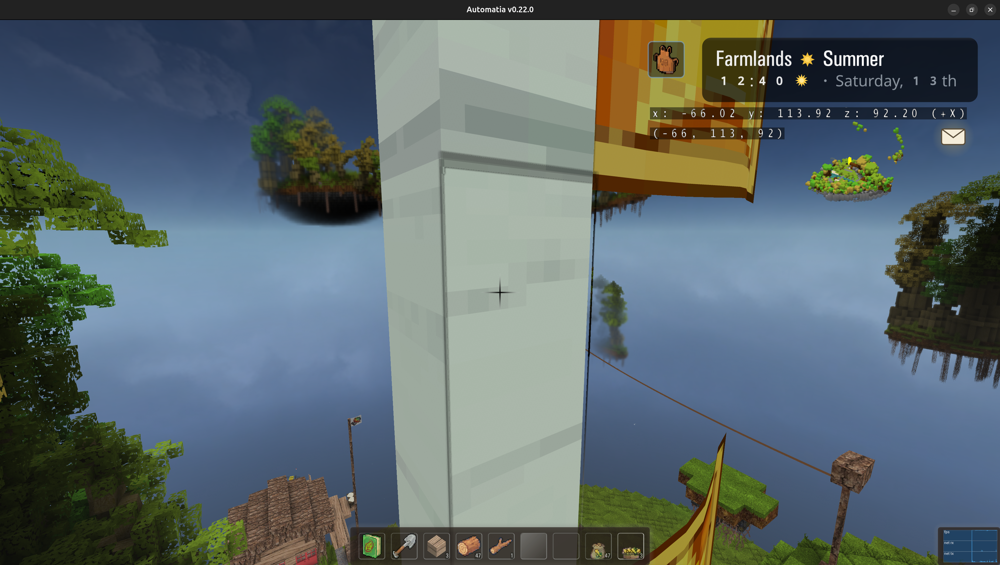

Additionally, the player is able to push and pull certain block entities now, and a new boomerang block can be used to push floating pushable platforms.

It's also possible to slide down icy stairs.

### Gamepad support

I've gone through most widgets now and made sure gamepad support is fully working, including all new GUIs. There is also gamepad sensitivity/deadzone settings in the settings menu now.

## Apiary upgrades

You can now ask the old man to build and upgrade your apiaries all the way to two levels (main + super). They now also drop wax in addition to honey.

## Wild hives

Wild hives have been scattered around the islands, and take a long time to create honey and wax, but an explorative player will find free shit.

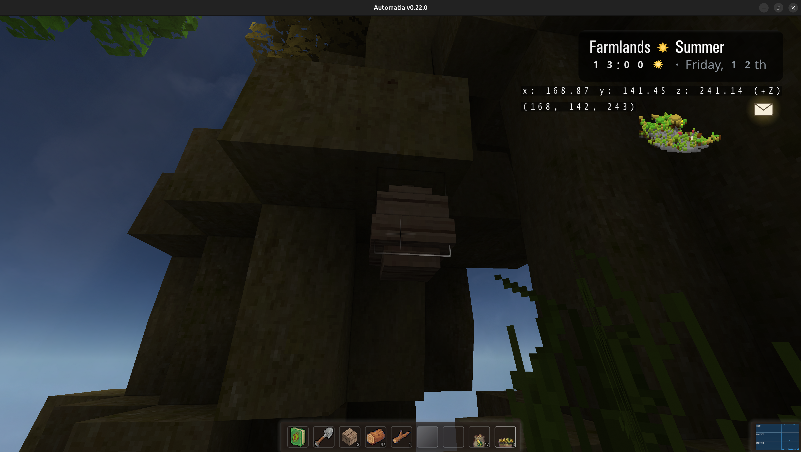

The hives have a honey drip when they have something.

## Anthills

I've placed anthills in dark corners in the woods, which produce honey dew, and very occasionally some random ass shit (as in random loot). Good hunting.

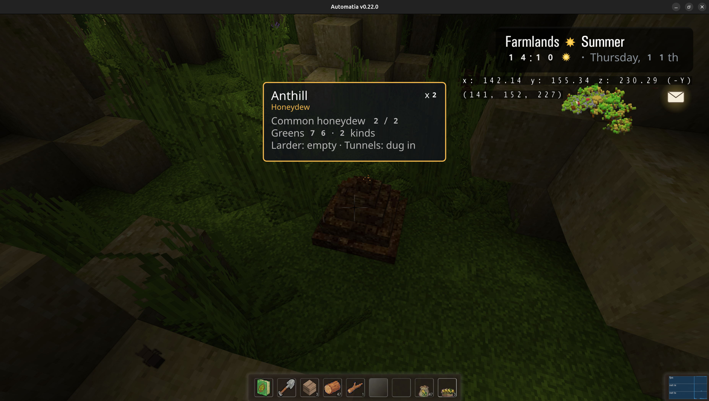

## Chicken coop

The chicken coop building is now present, and can be restored, after which chickens can be bought.

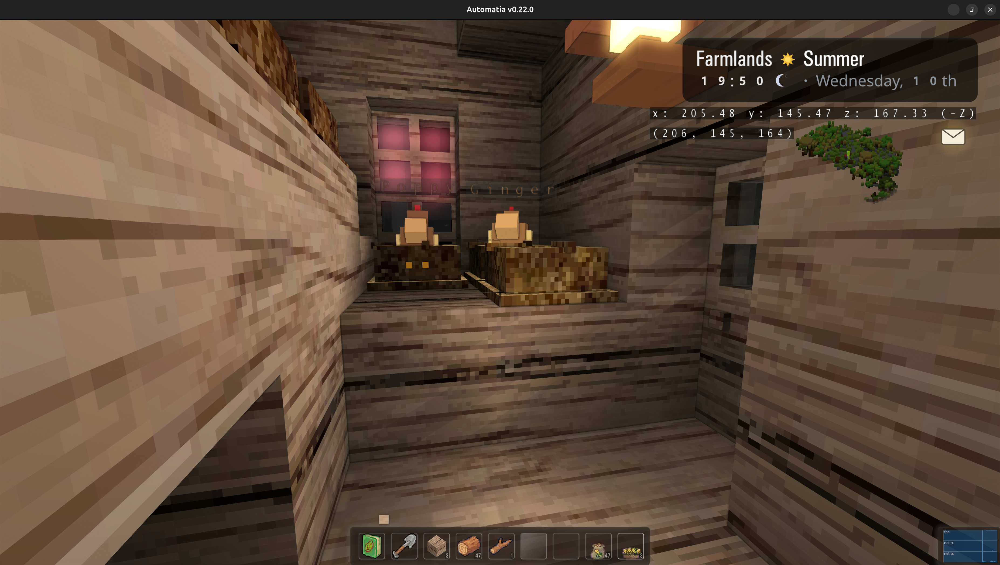

This is the newest change, and is therefore the least tested.

## Overhauled worktable

The worktable is now hold-to-craft and can produce rare bonus outputs. The all recipes tab now also has filters (eg. based on what you have).

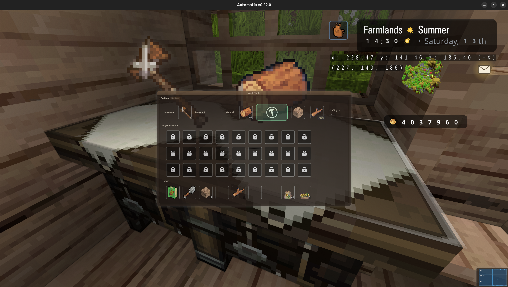

## Overhauled alchemy station

Brewing with alchemy now requires some balancing. I decided against any punishing behavior because brewing takes a lot time, but balancing the brew is very worthwhile.

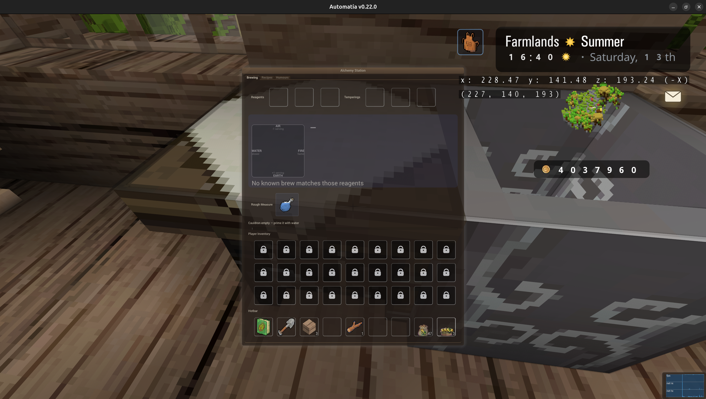

The layout needs compressing so large UIs still fit.

## New kitchen counter & chopping board

Cooking. Chopping.

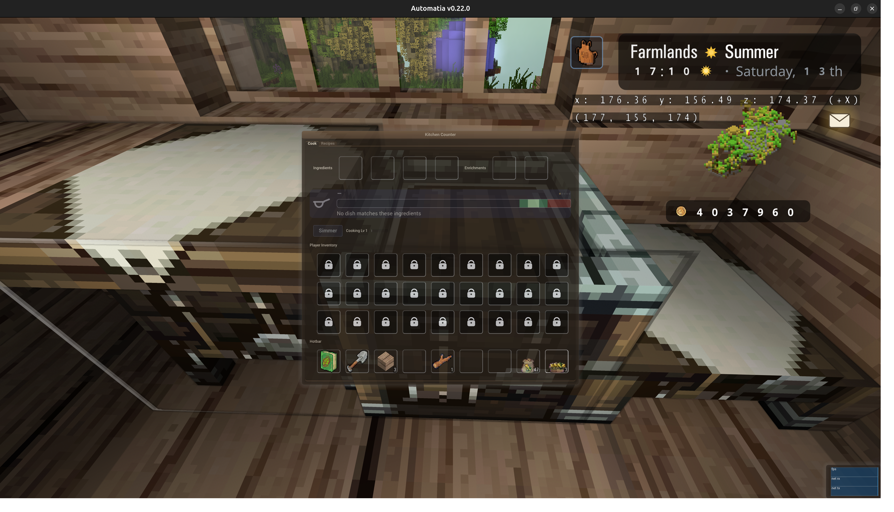

## New wand wright

Create wands, but don't make a mistake.

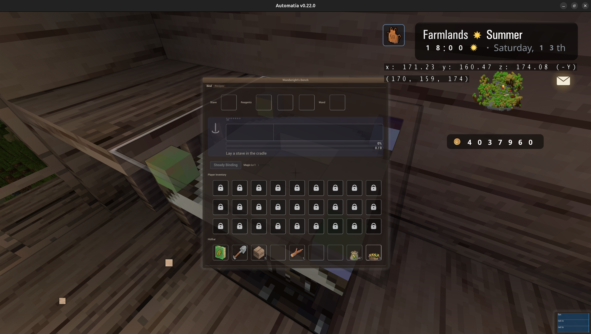

## New steeping font

A way to slowly imbue something with magic, over a long period of time. Can the soil be imbued?

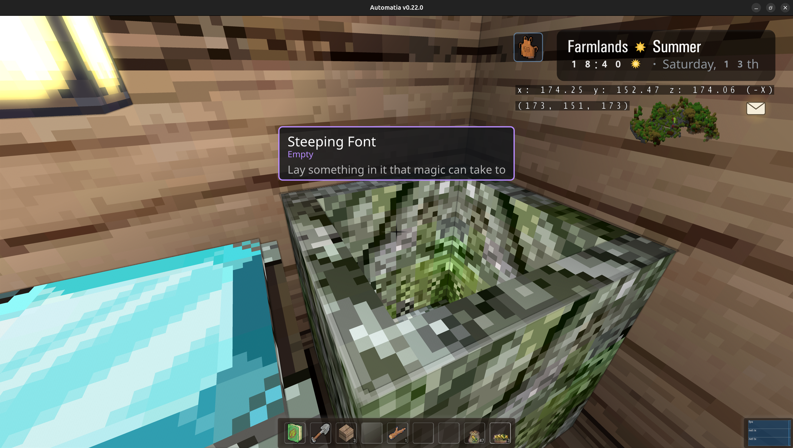

I will make the model a bit fancier later.

## New ziplines

The player can hitch a ride with ziplines, as long as they are working (eg. have been repaired first). There are derelict ziplines that traverse long distances now.

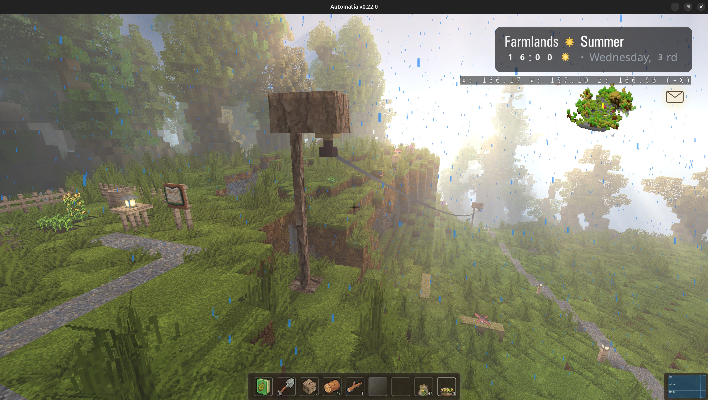

## Gravestones & Fireflies

There are fireflies around ponds now. And I added gravestones. Can you find them?

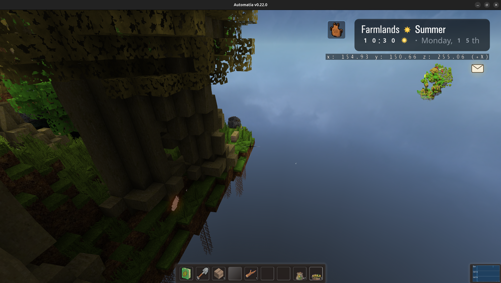

## Grove trees & mushrooms

There are now choppable trees and mushrooms growing on the players island.

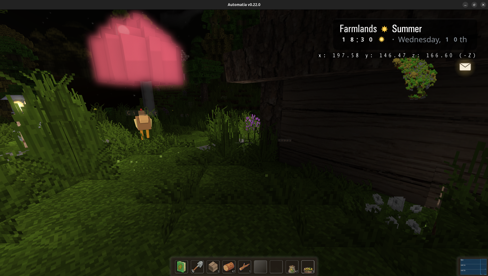

The mushrooms send spores at night, and some kind of mushroom-like NPC is spawning near them (also at night).

## Mining in the caverns

It's now possible to mine in the caverns below the players island. It's a work in progress feature. The caverns regrow over time.

## Tall crops

The first tall crops are in, eg. maize. Maize regrows instead of having to be replanted. Sold at a premium.

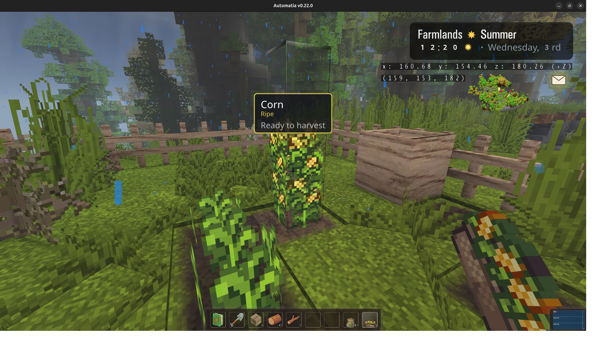

## Magic soil

There's a new magic soil that crops can be planted on.

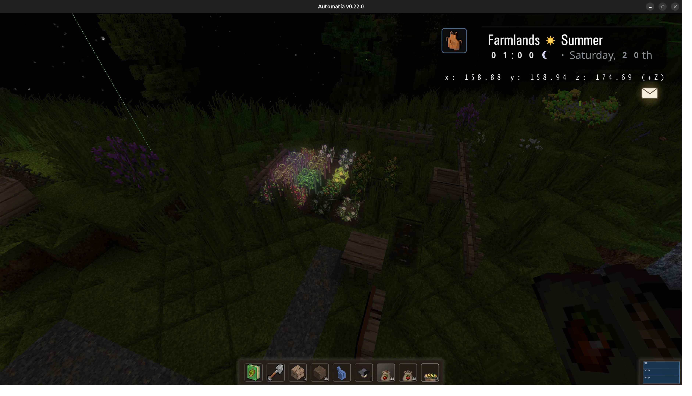

It's an early, slow source of magic.

## Final thoughts

The game has also received an overhaul of the crafting system, balancing recipes better. But, while things are still changing every day, there is not going to be a time where everything is perfectly balanced.

In the coming weeks I will work more on animals, like the chickens, and trying to improve the early game. I have an idea for bird houses in trees, but not sure how to place that in the produce system. There is also an upcoming sky winch with some kind of sky-based production, where players are air-lifted into the clouds.

Thanks for reading. Bye.

-gonzo
