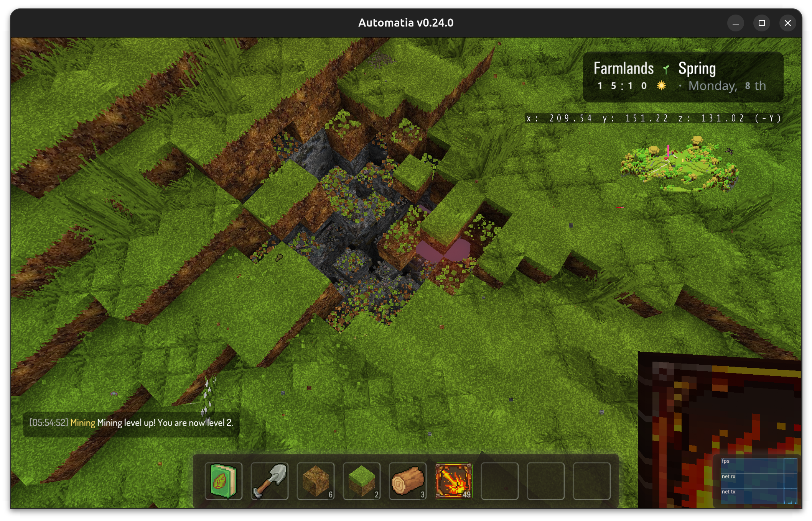
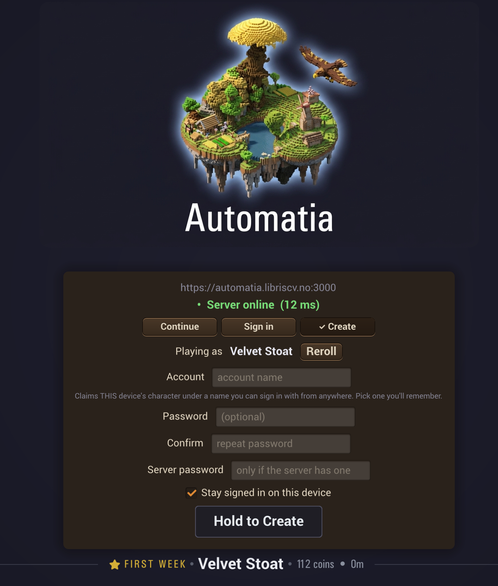
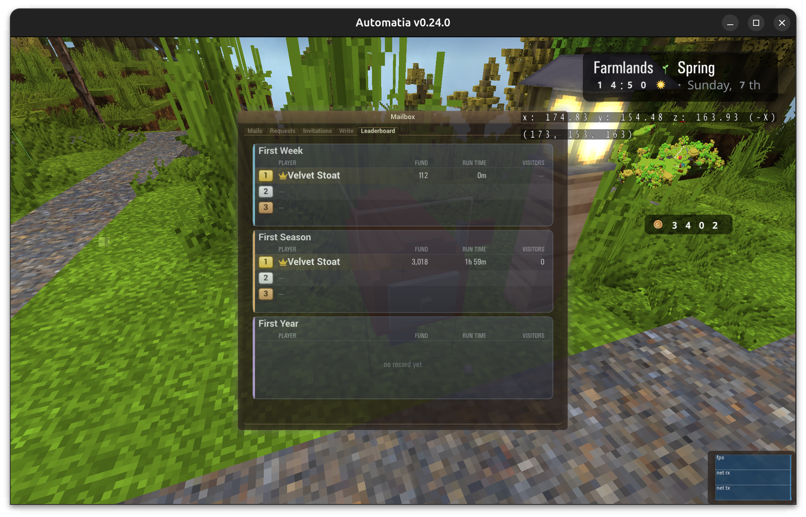
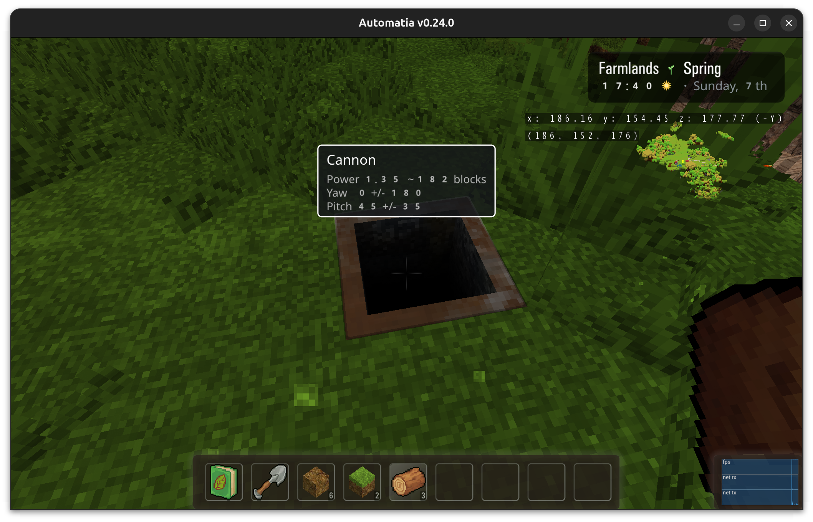
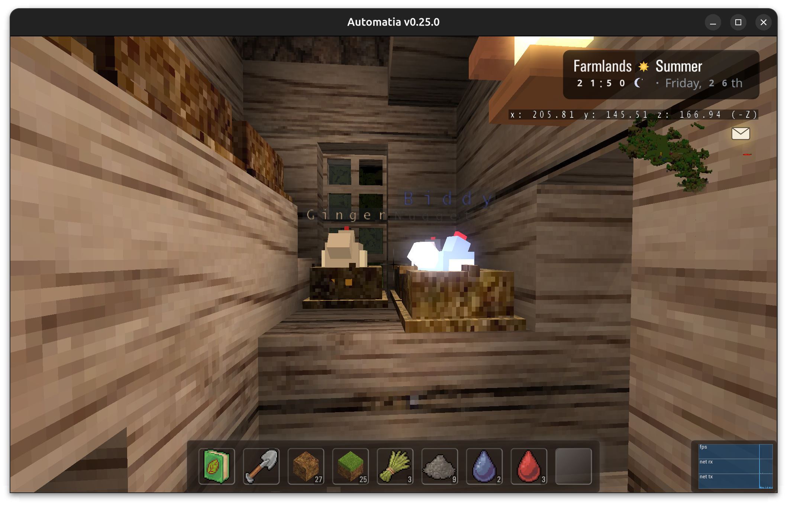
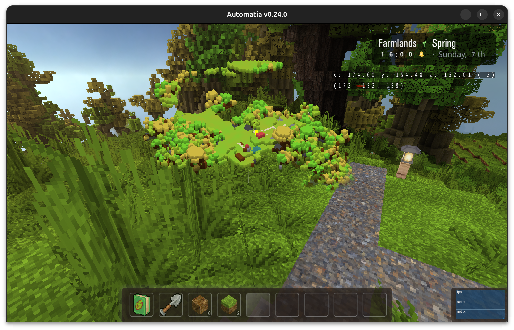
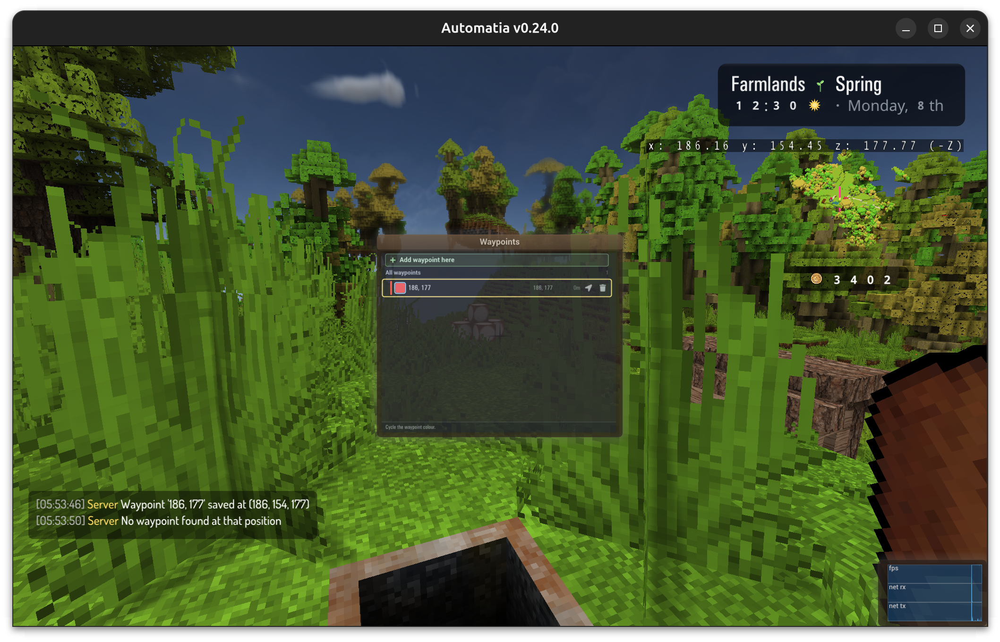

The whole island is now modifiable. Free modification is no longer just a cavern thing, it applies everywhere except in towns, and that single change has turned Automatia into a story-based sandbox. On top of that: a real login screen with accounts and device linking, leaderboards, cannons, and a big round of performance and size reductions.

<!-- truncate -->

## The island is editable

The modification rules that let players dig below the starter island mine, and let it regrow over time, have been extended to the entire island. You can now modify the world everywhere, except towns: town buildings, roads and so on are still protected.

Hard to relay in a blogpost, but it's the most important change I've made in a long time. The game does feel like a farming/neighbor game. Now it also feels like an (almost) unconditional sandbox on top. Now nobody is going to stop you from carving a tunnel through a hill you had a beef with. In the future I will extend it to the other islands nearby, covering the whole area, but that's now a content change.

There's a lot of machinery behind this and it's too detailed for a blog post. But essentially it's the same thinking (and the same frustration) that dealt with hidden chambers and loot chests after free mining was introduced, which eventually led to the solution that allows free sandboxing. Not every issue is solved yet, but I don't foresee any architectural blunders. Fingers crossed.

## Login, accounts and device linking

There's a new login screen with proper account setup, account login and device linking.

You can play from your desktop client and from a browser anywhere, using the same account.

## Leaderboards

Whoever has the most money during the _first week_, the _first season_ and the _first year_ will be forever remembered.

Unfortunately for me, admins are exempt and cannot be recorded. In order for leaderboards to be (somewhat) fair, runs record all unique visitors and display them on the leaderboard. The leaderboard *may* skip over runs with a certain amount of visitors for fairness. I think to start with anyone can have at least one visitor, and the run should count. This is a co-op game after all.

## World events

I've implemented a few world events now:
- Meteor shower
- Thunderhead
- Void night
- Quiet day

All of which can happen in the players world.

## New blocks

A few new blocks this week. The most interesting one is the cannon block, which lets you, yep, launch yourself into the air. It's a fast way to go places.

### Cannon

The cannon applies a temporary effect that lets you land on your feet despite hard falls. Just don't shoot yourself into space.

### Tiered loot

Tiered loot chests have been placed around the players islands, just waiting for discovery. And a few platforms that disappear under your foot if you can't keep up.

### Moth roost

Moths hunt at night and eat mushys. Moths travel far and their roosts will be rare.

### Magic chickens

Chickens can now eat the mushys jumping around from mushrooms.

## Performance

A fair amount of client performance work this week.

- The atmosphere shader and block entity rendering have both been optimized heavily. Those were two of the biggest costs in a normal frame.

- The 3D minimap used to be rebuilt and remeshed on every update, which was as expensive as it sounds. It's now updated in parts and rolls over, with vertices positioned modulo the roll values, which means world movement does not trigger minimap updates by itself. That also made it possible to *increase* the minimap quality while still being faster than before.

- I've added support for proxy occlusion queries, which stabilizes FPS (but introduces minor popping on fast camera movement). This change alone has made it possible for me to play on my much weaker 2016 laptop (with 80% render scale).

- Finally, the physics thread has much smarter stall reduction. If it's under stress it will skip work that isn't worth the time right now, for example the spatial reverb scan.

The minimap can be improved more in the future.

## Smallification

I've been working on reducing the size of the game across the board:

- The WASM blob is now **34 MB**, down from 100+ MB, mostly due to music being streamed.
- The Win64 client is now **103 MB**, down from 150+ MB.
- The server now uses a palette-based abstraction for blocks, reducing its footprint by **200 MB per live player instance**.

Not sure if the palette abstraction should be brought to the client. The client has some brutal quadruple-fill lighting paths that benefit from the fixed O(1) access to the world. I think as long as anyone is CPU-bound I will not consider this change.

## Various

- Weather and crops now change during the night (when players sleep) instead of exactly at midnight
- Night vision potions now work
- Pond restorations now drain over time
- OpenAL now has reverb support, and it's working and tested on the Windows client.
- Waypoint management has a dedicated widget now, with gamepad support.

## Final thoughts

At this pace this will be a game, methinks. The sandbox change has made some things redundant now. For example, the apiaries should just be sent to the players mailbox and they can place them wherever they like. Or I should just remove those jobs and replace with something else. Not sure yet.

Unfortunately no time to work on animals or the sky winch this week. Maybe next week. We'll see.

Thanks for reading. Bye.

-gonzo
