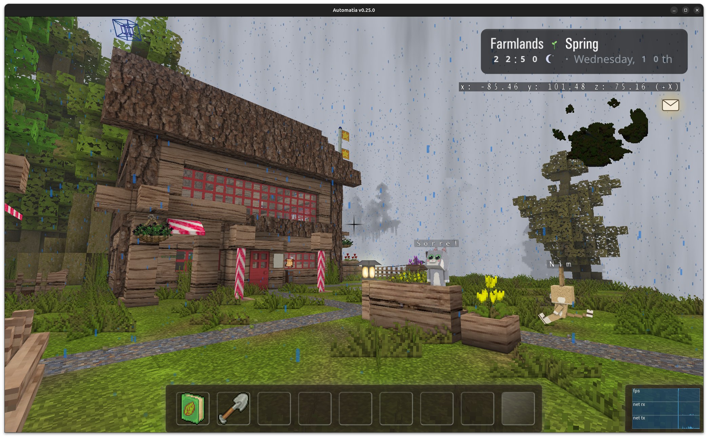
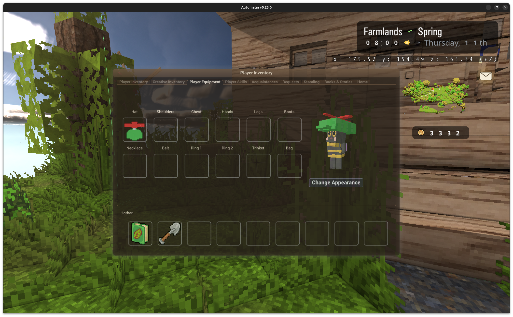
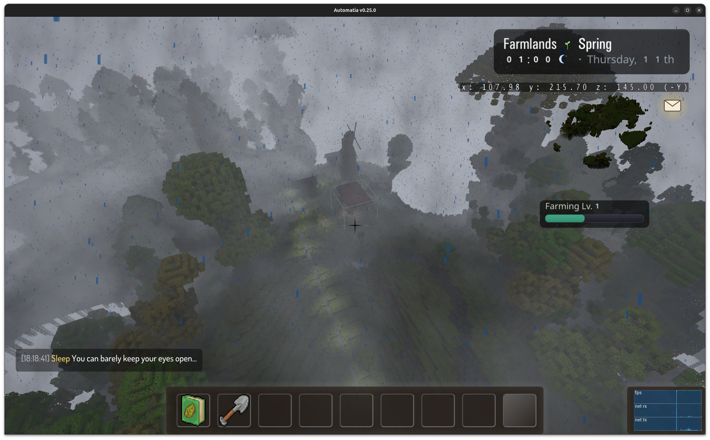

There's a character creator now, with 9 playable types, 8 of which are brand new kin models. On top of that: short-lived floor-based dungeons like The Mines, a work-in-progress sky path, hats (and other cosmetics) that attach to your character, and seasons that now change slowly instead of flipping all at once.

<!-- truncate -->

## The character creator

The game now has a proper character creator. There are 9 playable types to choose from, and 8 of them are new kin-type models:

- **Bearkin**
- **Catkin**
- **Sporekin**
- **Snailkin**
- **Hopkin**
- **Mothkin**
- **Bumblekin**
- **Owlkin**

Some of them are fairly regular animals, others are rarer things. The change doesn't do anything that affects gameplay yet, but it changes a lot for me and what the story can offer, and for people who wants to play as something else.

For now, kin is unlocked simply by finding anyone of a kin and talking to them. Players can only start as human.

## Attachments and cosmetics

The new playable types also gained support for attachments, which mostly means: hats, clothing etc.

I've added a bunch of cosmetics, including a decent number of funny ones. I've hidden them around the world(s). Expect to find stupid hats in stupid places.

## Dungeons

The second big item this week is short-lived floor-based dungeons. These are a new mechanic: you enter, you descend, and you make progress over time rather than clearing them in one sitting. Once you leave a floor, it's never the same floor again the next time. Some floors are special, and may not be ephemeral (or even randomized).

### The Mines

The Mines has **50 floors**. You slowly work your way down, and every 5 floors you get a checkpoint.

There's also whispers of a secret floor.

### The sky path

The sky path is the other one, and it's still very much a work in progress. It's an obstacle course, going up instead of down.

It builds on work from earlier: sliding, pole climbing, the hookshot, pushable platforms.

## Seasons crossfade now

Previously each season change flipped the world's look instantly. Now I've divided the seasons into more colors, and each day gets a new color in between.

The result is that the world slowly changes around you.

The last image is a few days later, when it's greener.

## Graphics

I've added a new voxel-based fog and clouds. I wanted to try something I saw online called froxel-fog that can be very fast (0.5ms) compared to brute-force (50ms). However, I could not implement it as explained 1:1 because browser WASM/WebGL2 is a first-class target and doesn't have compute shaders. Nevertheless, `glFrameBufferTextureLayer` kind of works (although not nearly as cheap as a compute shader).

It might be ok to make this default enabled, but I don't want to lag players with low-end hardware too much when logging in the first time. Players with fancy computers will just max everything anyway.

## WASM

Scripting and modding in my game is (among other things) backed by my own libriscv project, a RISC-V CPU emulator. It supports a JIT mode to enhance performance on desktop platforms. In WASM we can provide this at link-time or simply embed the script from binary translation to a C99 file. That is, libriscv supports emitting pre-compiled binary translation by writing a C source file you can compile and link with, which auto-registers the binary translation. It's very very performant, but it's no longer dynamic.

I've added a baked binary translation option to my WASM builds now. I initially thought simply emitting the C file with matching configuration was enough, but.. there is an arena-offset optimization that relies on the size of the Machine structure itself, which is different in WASM compared to my desktop. Hence, I have to generate the baked bintr through a WASM toolchain CLI. The baked bintr is nearly native performance, which is nice, but it takes a while to compile it. And if the server has a newer script, then the baked bintr will have to be ignored, and it falls back to interpreter performance again.

## Final thoughts

I'm very happy with the kin types, and that I made an effort to make two of them flying (as NPCs). The world just feels bigger with them in it.

Next up is probably finishing the barn work, and integrating kin NPCs properly into the world. Also more hats. There can never be enough hats.

Thanks for reading. Bye.

-gonzo
