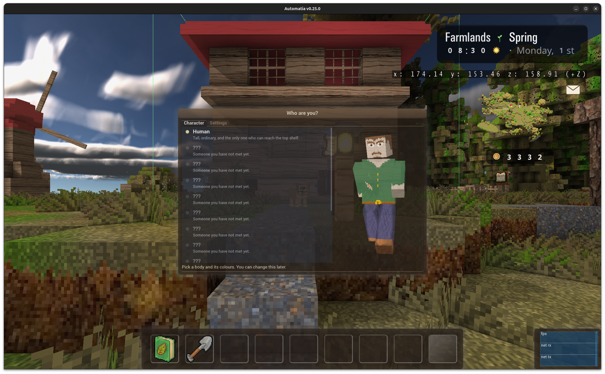
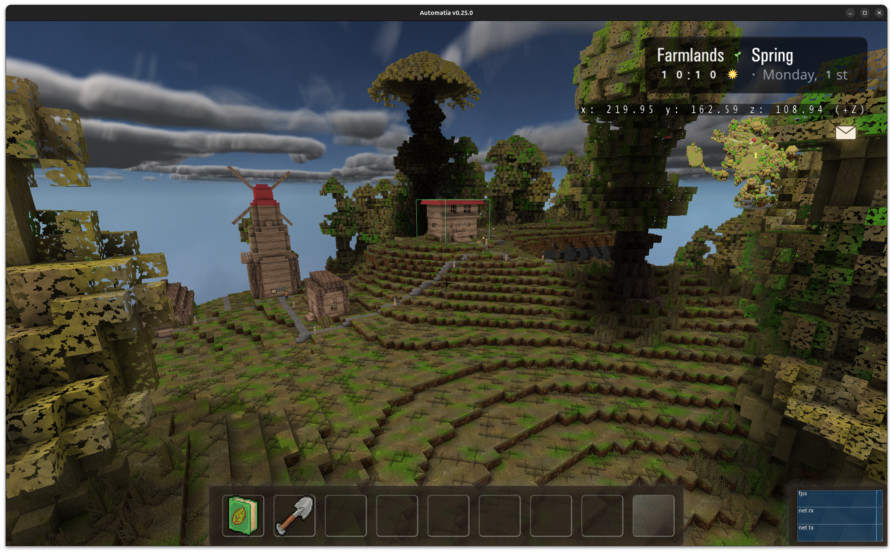
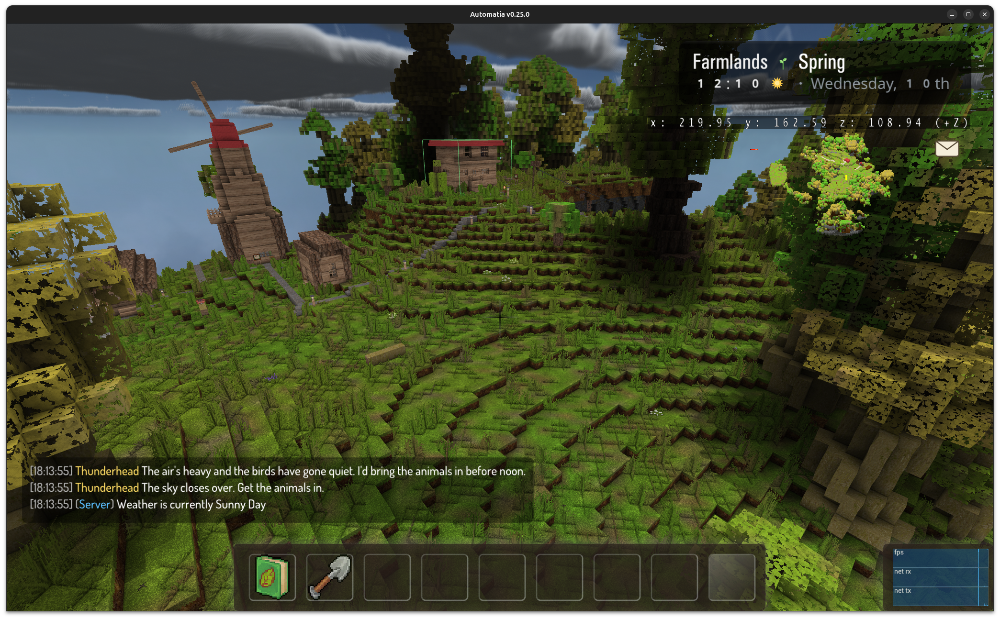
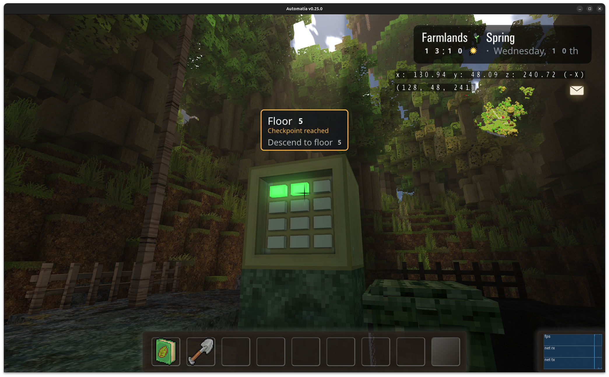
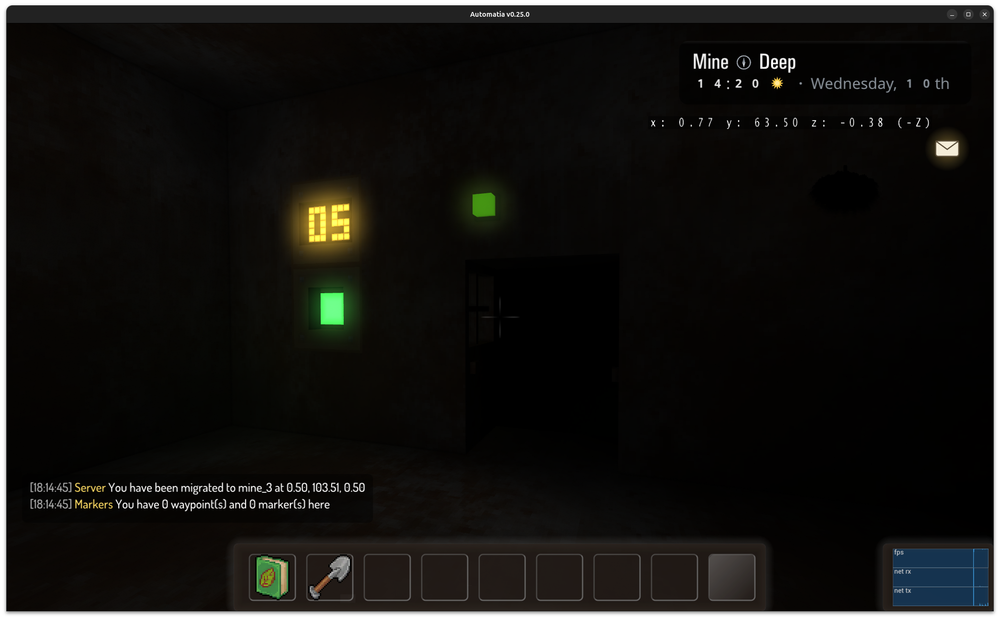
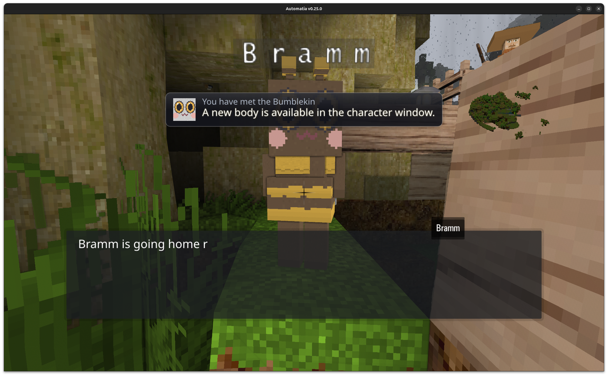

There's a character creator now, with 9 playable types, 8 of which are brand new kin models. On top of that: short-lived floor-based dungeons like The Mines, a work-in-progress sky path, hats (and other cosmetics) that attach to your character, and seasons that now change slowly instead of flipping all at once.

<!-- truncate -->

## The character creator

The game now has a proper character creator. There are 9 playable types to choose from, and 8 of them are new kin-type models:

- **Bearkin**
- **Catkin**
- **Sporekin**
- **Snailkin**
- **Hopkin**
- **Mothkin**
- **Bumblekin**
- **Owlkin**

Some of them are fairly regular animals, others are rarer things. The change doesn't do anything that affects gameplay yet, but it changes a lot for me and what the story can offer, and for people who wants to play as something else.

For now, kin is unlocked simply by finding anyone of a kin and talking to them. Players can only start as human.

## Attachments and cosmetics

The new playable types also gained support for attachments, which mostly means: hats, clothing etc.

I've added a bunch of cosmetics, including a decent number of funny ones. I've hidden them around the world(s). Expect to find stupid hats in stupid places.

## Dungeons

The second big item this week is short-lived floor-based dungeons. These are a new mechanic: you enter, you descend, and you make progress over time rather than clearing them in one sitting. Once you leave a floor, it's never the same floor again the next time. Some floors are special, and may not be ephemeral (or even randomized).

### The Mines

The Mines has **50 floors**. You slowly work your way down, and every 5 floors you get a checkpoint.

There's also whispers of a secret floor.

### The sky path

The sky path is the other one, and it's still very much work in progress. It's an obstacle course, going up instead of down.

It builds on work from earlier: sliding, pole climbing, the hookshot, pushable platforms.

## Seasons crossfade now

Previously each season change flipped the world's look instantly. Now I've divided the seasons into more colors, and each day gets a new color in between.

The result is that the world slowly changes around you.

## Final thoughts

The kin types are the change I'm most happy with, even though they're the least mechanical thing here. The world just feels bigger with them in it.

Next up is probably finishing the barn work, and integrating kin NPCs properly into the world. Also more hats. There can never be enough hats.

Thanks for reading. Bye.

-gonzo
